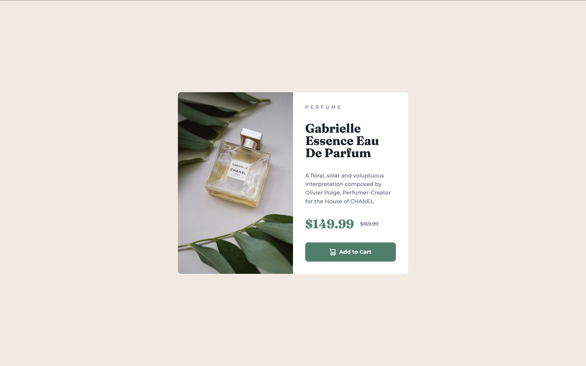
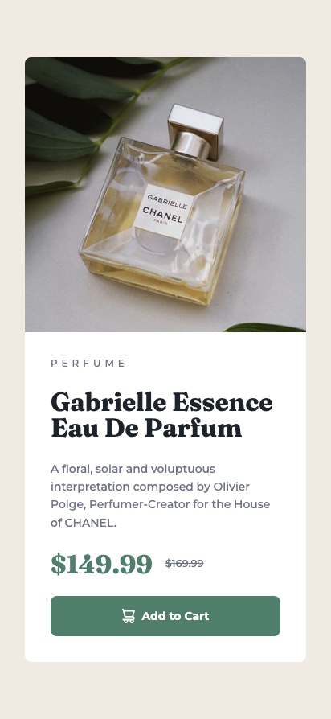

# product-preview-card-component

This is a solution to the Product preview card component challenge on Frontend Mentor.

## Overview

### Screenshot

| Desktop |
|---------|
|  | 

 Tablet | Mobile |
|--------|--------|
  |  |

## What I Learned: Responsive Component Development

### 1. The REM Strategy for Accessibility and Scale

Using rem units with the 62.5% trick (1 rem = 10 px) provides a scalable approach to typography, spacing, and dimensions. This technique allows for proportional scaling and respects user browser font size settings, maintaining visual consistency across different user preferences.

### 2. Handling Responsive Images with `<picture>`

The native HTML `<picture>` element with `<source>` tags enables efficient image delivery based on viewport size. The browser loads only the appropriate image resource for the current screen size, optimizing performance and reducing data usage.

### 3. Flexbox Precision and Layout Fixes

The Flexbox property `flex: 0 0 50%;` can create precise equal-width splits in layouts. This approach prevents layout issues caused by padding overflow. Combined with `object-fit: cover;`, images can fill their allocated space while maintaining aspect ratio without distortion.

### 4. Attention to HTML Semantics and Button Types

Setting `type="button"` explicitly on button elements ensures they function only for client-side interactions without triggering default form submission behavior. This practice supports proper semantic HTML structure and predictable element behavior.